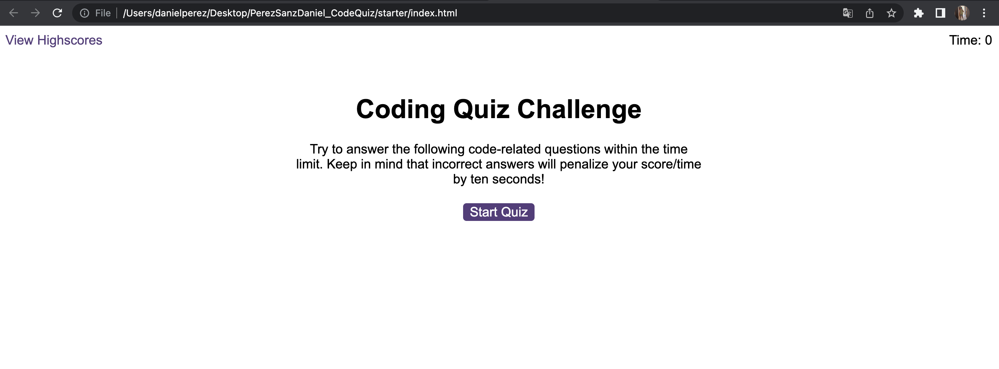
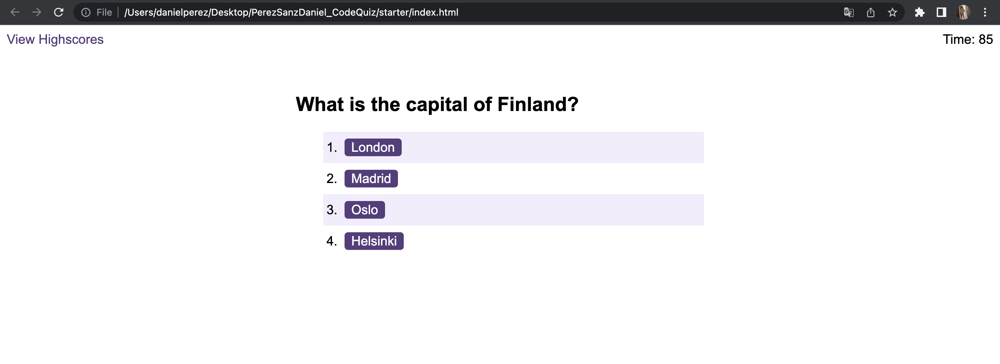
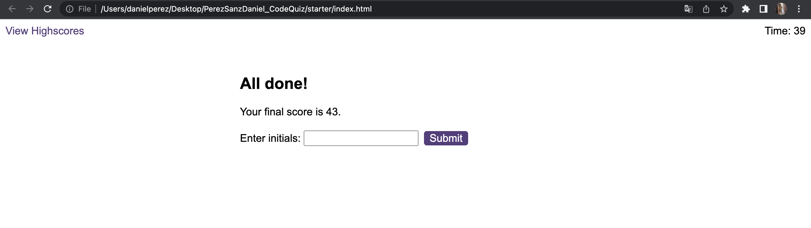

# PerezSanzDaniel_CodeQuiz

Challenge Week 6: Code Quiz

## Description 

In this project I introduce a real-world application to JavaScript and Web APIs. The aim is to build a timed coding quiz with multiple-choice questions. You can see a demo [here](https://danielpsnz.github.io/PerezSanzDaniel_CodeQuiz/).

## Usage 

The portfolio should be seen as below: 

## Credits

[Daniel Pérez](https://github.com/danielpsnz)

## License

The license used is MIT License. Here is more information about it. 

[https://github.com/danielpsnz/PerezSanzDaniel_CodeQuiz/blob/main/LICENSE)
